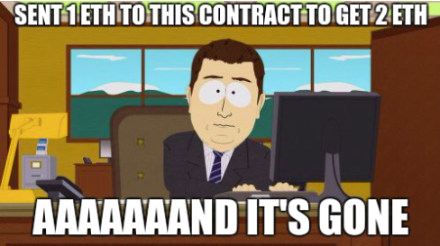
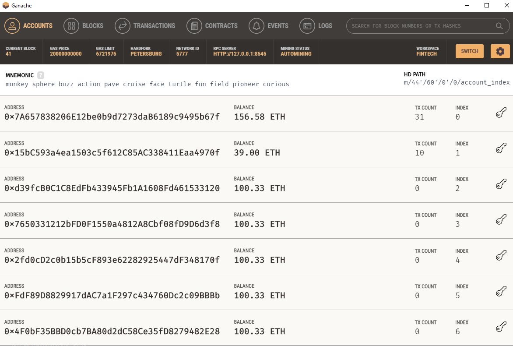
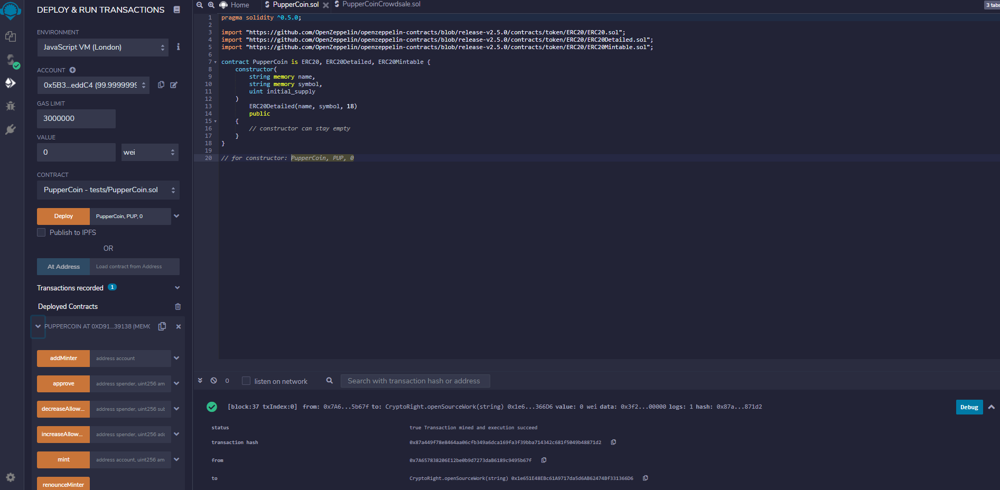
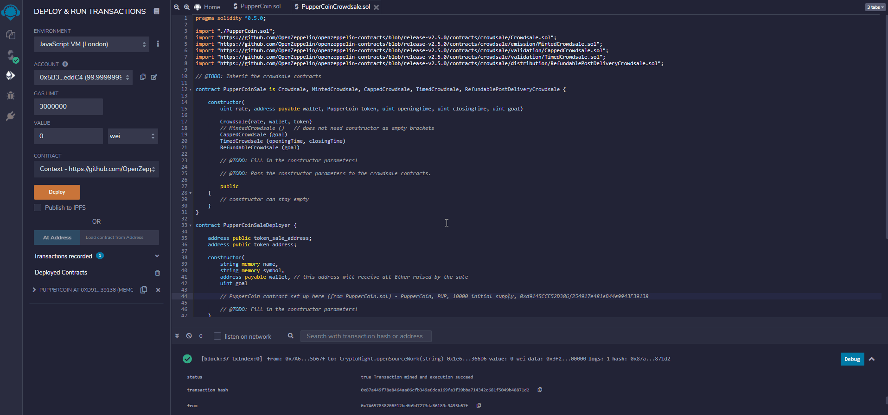
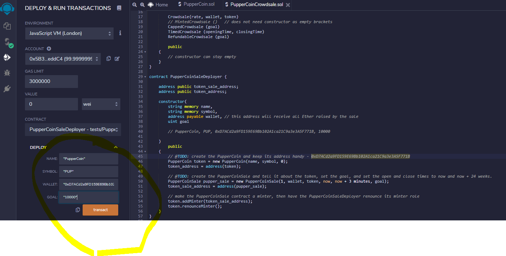
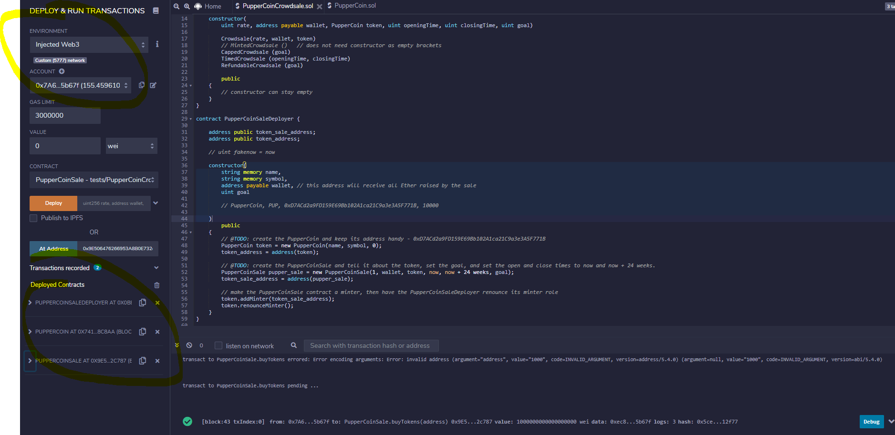
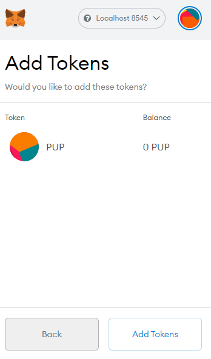

# PupperCoin

## Background
Your company has decided to crowdsale their PupperCoin token in order to help fund the network development.
This network will be used to track the dog breeding activity across the globe in a decentralized way, and allow humans to track the genetic trail of their pets. You have already worked with the necessary legal bodies and have the green light on creating a crowdsale open to the public. However, you are required to enable refunds if the crowdsale is successful and the goal is met, and you are only allowed to raise a maximum of 300 Ether. The crowdsale will run for 24 weeks.

## Process
- PupperCoinDeployer - first deployed identifying name (PupperCoin), symbol (PUP), wallet (i.e. '0x5B38Da6a701c568545dCfcB03FcB875f56beddC4'), goal (300 ETH)
- PupperCoin - then deployed to token_address from PupperCoinDeployer
- PupperCoinSale - last deployment using token_sale_address from PupperCoinDeployer

## Screenshots

Ganache

Deploying Puppercoin

PupperCoinCrowdsale Code

Deploying Puppercoin

Injected Web3

Metamask - Token Added (pending crowdsale close)

